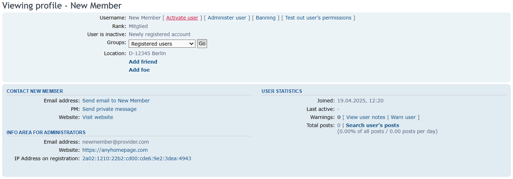
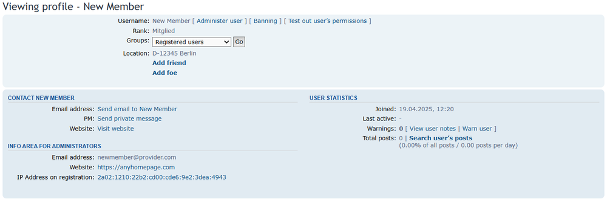

# phpBB Quick Activation in Profile

## Description

This extension enables newly registered users to be activated directly in the user profile. Activation in the user administration can then be omitted.
The extended user profile also contains the e-mail address, website address and IP address for the administrator to read. 

**Settings in User Control Panel**
- No settings.

**Settings in Administration Control Panel**
- No settings.

## Screenshots

## Requirements
- phpBB 3.3.0 or higher
- php 7.2 or higher

## Installation
Copy the extension to phpBB3/ext/moemorox/qaip. Go to "ACP" > "Customise" > "Manage extensions" and enable the "Quick activation in profile" extension.

## Update
Navigate in the ACP to Customise -> Manage extensions.
Click the Disable link for "Quick activation in profile".
Delete the qaip folder from phpBB3/ext/moemorox/.
Copy the extension to phpBB3/ext/moemorox/qaip.
Go to "ACP" > "Customise" > "Manage extensions" and enable the "Quick activation in profile" extension.

## Uninstallation
Navigate in the ACP to Customise -> Manage extensions.
Click the Disable link for "Quick activation in profile".
To permanently uninstall, click Delete Data, then delete the qaip folder from phpBB3/ext/moemorox/.

## Changelog
### v1.0.3 (23-04-2025)
- Optimised performance (Thanks to IMC)
- Fixed bug showing "Info area for administrators"-h3 to non-admin users
### v1.0.2 (19-04-2025)
- Code changes
- Optimised templates
- New language files
### v1.0.1 (16-04-2025)
- Code changes
- Optimised template
### v1.0.0 (01-04-2025)

## License
[GPLv2](https://www.gnu.org/licenses/old-licenses/gpl-2.0.en.html)
